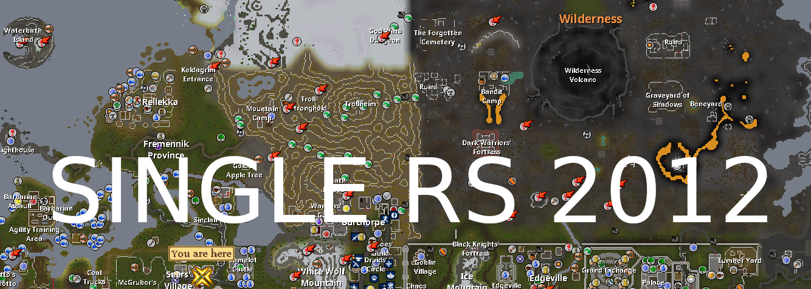
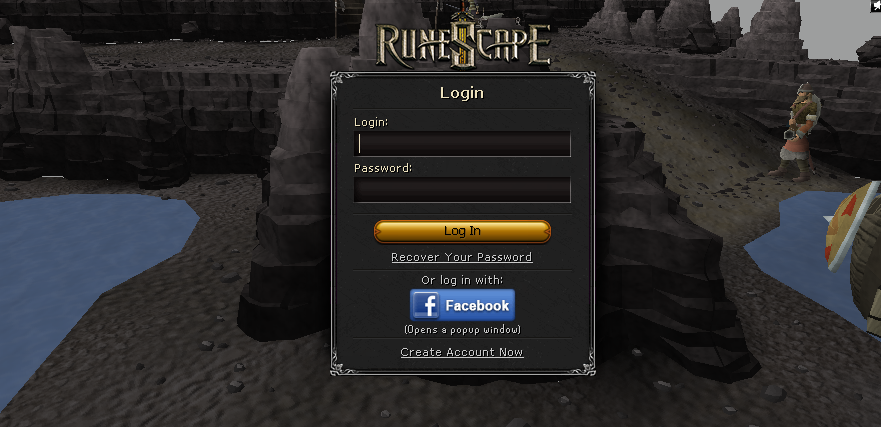
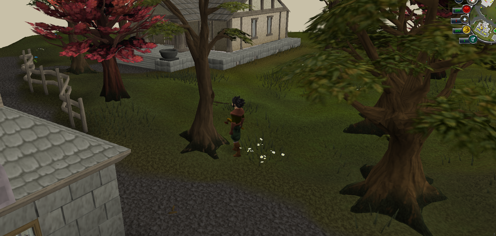
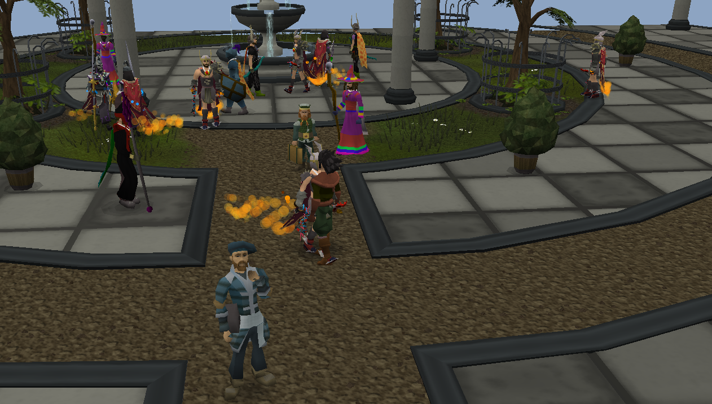

# Single RS 2012



Play a private, self-contained 2012-era RuneScape world on your own computer.
The matching client and world server launch together, all progress is saved
locally, and 286 simulated players make the world feel populated.

[](https://github.com/kennethyork/single-rs-2012/releases/latest)
[](https://github.com/kennethyork/single-rs-2012/actions/workflows/platform-smoke.yml)
[](LICENSE)

[Download the latest release](https://github.com/kennethyork/single-rs-2012/releases/latest)
· [Visit the website](https://singlers2012.kennethyork.com)

Single RS 2012 is built from the Darkan world server, client, loader, and cache
projects with the hosted dependencies removed. Normal gameplay needs no hosted
server, MongoDB, lobby service, or internet connection. The client connects only
to the world running at `127.0.0.1`.

## Download and play

Download the archive for your computer from the
[latest release](https://github.com/kennethyork/single-rs-2012/releases/latest),
extract the entire archive, and use its launcher:

| Platform | Start at 1x XP | Example with 25x XP | Notes |
| --- | --- | --- | --- |
| Linux x64 | `./run.sh` | `./run.sh 25` | Run from a terminal if double-clicking is disabled |
| Windows x64 | `run.bat` | `run.bat 25` | Keep every extracted folder beside the launcher |
| macOS x64 | `./run.command` | `./run.command 25` | Apple Silicon requires Rosetta 2 |

Release archives already contain the game cache, prebuilt jars, and Java 24.
You do not need to install Java or build the source to play.

At the login screen, enter any new username to create a local character.
Passwords are not used; if the client requires text in the password field, the
text is ignored. The username `root` has access to owner commands.

## What is included

- A local 2012-era world and matching client launched in one process
- Local characters, Grand Exchange, highscores, logs, and world state
- 286 simulated players with individual names, appearances, equipment, skills,
  combat levels, persistent progression, and visible daily routines
- Social players throughout towns, Daemonheim, and the Grand Exchange
- Public chat, private messages, bot-to-bot chatter, and persistent clans
- A mix of solo bots and regional groups that move, train, rest, and progress
- A Player Marketplace for direct trading with simulated players
- 88 attackable Wilderness PK bots
- Activity helpers for bosses, Dungeoneering, and Pest Control
- Every lodestone destination unlocked, including quest-gated locations
- Any whole-number XP multiplier, with 1x used by default
- Autosaving every 30 seconds and a final save during a normal shutdown

Activity helpers do not earn XP, generate drops, or create saved accounts. The
Wilderness players are the only population bots that can attack or be attacked.

| Login | Gameplay | Grand Exchange players |
| --- | --- | --- |
|  |  |  |

## Single-RSC comparison

Current comparison: **Single RS 2012 v0.15.0** and **Single-RSC v2.8.2**.

| Area | Single RS 2012 | Single-RSC |
|---|---|---|
| Bot population | 286 configured simulated players | 200-player roster with up to 80 online simultaneously |
| Player representation | Headless `Player` entities; Wilderness PKers are NPC-based | Headless `Player` entities; Wilderness bots are NPC-based |
| Skills | 25 visible skills | All 18 RSC skills |
| Real skilling | Strong native woodcutting, mining, and fishing | Broader mixture of native gathering, production, combat, and some simulated XP actions |
| Combat | 88 dedicated Wilderness PKers; the normal population is not attackable | Fighters train against NPCs; Wilderness bots attack players and each other |
| Movement | Collision-checked resource searching, regional routines, and stuck recovery | Regional travel, skilling sites, banks, route recovery, and staggered decisions |
| Social systems | Friends-list PMs, clans, clan recruitment, bot groups, and clan parties | Public chat, private bot chat, grouped chat, following, roles, and party modes |
| Ollama | Public, private, clan, and bot-to-bot conversation with persistent identities | Public, private, and grouped conversation with persistent identities |
| Trading | Player Marketplace plus fuller 2012 Grand Exchange integration | Direct bot marketplace plus shared GE-style stock |
| Grouping | Persistent regional/player groups of up to eight | Persistent skilling, combat, boss, Wilderness, and social groups |
| Highscores | Player and bot rankings across 25 skills | Player and bot rankings across 18 RSC skills, including saved XP rates |
| Saving | 30-second world autosave and shutdown save | World-bot state every 60 seconds plus normal character saving |
| Bot quests/minigames | Boss, Dungeoneering, and Pest Control helpers that do not earn XP or complete content | Party modes assist in fights, but bots do not complete quests or minigames |
| Player automation | None | Removed completely |
| Mobile | Desktop platforms only | Android client available; autonomous world bots remain desktop-only |
| XP setting | Any positive whole number at launch | 1x–50x saved per character |

Single RS 2012 remains stronger as a socially connected simulated MMO because of its larger population, Friends List integration, clans, regional routines, marketplace, and polished native resource gathering. Single-RSC is stronger at preserving the RSC presentation while providing broader classic skill coverage and more general-world combat activity.

Single-RSC is roughly 80% of the overall Single RS 2012 bot experience rather than exact parity. Its largest remaining gaps are real clan/Friends List integration, consistently native actions, richer autonomous routines, and genuine boss or minigame participation.

## Talking to players and using clans

Nearby simulated players can answer public chat. You can also message them from
the normal Friends List and speak with them in clan chat.

Each simulated player has an individual, stable personality tied to its name.
Every bot combines an archetype, temperament, speech style, favorite skill,
favorite activity, personal goal, and conversational quirk. Friendly skillers,
PKers, traders, clan loyalists, jokers, explorers, veterans, and boss hunters
therefore still sound different from other players in the same broad role.
The same identity also guides Ollama replies, so a bot remains recognizable
across public, private, and clan conversations and after restarting the game.

The population also lives instead of only standing at spawn. Most town players
form stable regional groups of up to four, while roughly one player in five
follows an independent routine. Bots search for actual nearby trees, rocks, and
fishing spots, travel to them, and invoke the same woodcutting, mining, and
fishing actions used by the human player. Tools, bait, skill requirements,
inventory space, XP gains, depleted resources, and respawns therefore use the
real game systems. Spawn points and movement targets are collision checked,
routes navigate around scenery, and idle bots recover from repeated route
failures instead of becoming trapped in fences or objects. When no valid
resource is nearby, bots travel or search instead of standing still and looping
an unrelated emote. Their new levels survive restarts in the local world save.
Inspect a player to see its current real task, group, accurate combat level,
personal goal, and all 25 live XP-backed skill levels. Those displayed levels
are the same stats the bot uses for combat and skilling. Bots have distinct
melee, ranged, or magic builds instead of identical combat skills, and genuinely
earned XP remains persistent. Wilderness bots patrol and PK instead of selecting
skilling tasks.

Use `::botgroups` to list up to eight groups within 32 tiles and see whether
each group is meeting, training, or resting. Group membership and progression
are stable across restarts.

Right-click a simulated player and choose **Group options** to join its activity
group. Selecting Group options on the same group again leaves it. A group you
lead can choose Fishing, Woodcutting, or Mining; members use whichever matching
real resources are available nearby.

To lead your own persistent group, use these commands:

| Command | Purpose |
| --- | --- |
| `::botgroup create My Team` | Form and name your group |
| `::botgroup skill Mining` | Choose the skill everyone trains |
| `::botgroup status` | Show your membership, activity, and invited bots |
| `::botgroup leave` | Leave a bot-led group |
| `::botgroup disband` | Disband the group you lead |

After creating one, choose **Group options** on bots to invite them. Choose it
again on one of your members to send that bot back to its regional team or solo
routine. You can
lead up to seven bots, making eight group members including you. Your invited
bots gather around and follow you while carrying out the selected routine.

## Website highscores

The website includes a private local highscore viewer for your character and
the persistent simulated-player population. The game creates
`saves/highscores-export.json` when you log in and automatically refreshes it
during its normal 30-second save. On the website,
choose **Connect live highscores** and approve that file once. Supported desktop
browsers remember the file and automatically reload current stats while the game
is running. The browser reads the JSON locally; it is never sent to a server.

You can also force an immediate refresh in game with:

```text
::exporthighscores
```

You can rank the live export overall or by any of the 25 skills. Browsers without
the persistent file-access feature retain a manual **Choose highscore export**
fallback. Search by display name or username, then click any character or bot to
open its complete combat, total-level, total-XP, and 25-skill profile.
The last valid rankings, active search, selected ranking, and open player profile
remain visible after a page refresh. If the browser does not retain permission to
the local file, click **Connect live highscores** again to resume live updates.

Right-click a simulated player for its social options:

- Join the player's clan when it belongs to one.
- Recruit a clanless player after creating your own clan from the Clan Chat tab.
- Inspect the player or open the Player Marketplace.

Some players intentionally have no clan, so the population contains both
established groups and players available for recruitment. Clan membership is
saved locally.

After recruiting clanless players into a clan you own, use `::clanparty` (or
`::clanpk`) to summon up to four of them as combat companions. They follow you,
assist against bosses and other NPC targets, and join fights against simulated
PKers in Wilderness multi-combat areas. Use `::clanparty status` to list the
party or `::clanparty dismiss` to send them home. Companions do not receive XP
or drops, and their damage is credited to you.

## Ollama-only bot conversations

Every bot conversation is generated by Ollama. There are no shared scripted
replies or canned fallback conversations. This includes spontaneous nearby chat
and bot-to-bot follow-ups as well as public, private, and clan replies. Install
[Ollama](https://ollama.com/download), download the default model once, and
leave Ollama running while you play:

```sh
ollama pull qwen3.5:4b
```

Requests to each player are queued in order, and separate public, private, and
clan conversations retain their own memory between game sessions. If Ollama or
the selected model is unavailable, bots remain silent and the game displays a
short status message instead of substituting a scripted response.

Useful in-game commands:

| Command | Purpose |
| --- | --- |
| `::ollamastatus` | Show the endpoint, selected model, queue, and connection state |
| `::ollamamodel` | Show the current model and suggested models |
| `::ollamamodel qwen3.5:4b` | Switch models and save the choice between game sessions |
| `::ollamamodel reset` | Return to the model in `simulated-players.json` |
| `::ollamaforget` | Delete your saved AI conversation memory |

Before switching, install that model in a terminal with `ollama pull model-name`.
You can switch while the game is running; the next bot reply uses the new model
without restarting the client or world.
The in-game choice is stored in `saves/ollama-model.json`, so updating the game
does not overwrite it.

The release configuration is at
`world/data/npcs/simulated-players.json`. From a source checkout, it is at
`darkan-world-server/data/npcs/simulated-players.json`. Its `activities` section
controls group size, action speed, XP per action, and save frequency. Its
`ollama` section lets you change the model, endpoint, timeout, memory length,
cooldowns, response delay, and history persistence.

With the default `http://127.0.0.1:11434` endpoint, prompts and model responses
stay on your computer. Conversation history is saved to
`saves/ollama-conversations.json` and is excluded from release archives. If you
configure a remote endpoint, your messages are sent to that service instead.

## Saves and backups

Everything unique to your game is stored under `saves/`. To back up or move your
world, close the game normally and copy that entire folder. This includes
characters, clans, Grand Exchange offers, highscores, bot skill progression,
persistent world state, and Ollama conversation memory.

Do not replace `saves/` when updating the game. Extract the new release, then
copy your existing `saves/` folder into the new game directory before starting.

## Troubleshooting

### The launcher says a jar or cache is missing

Extract the complete release archive instead of moving only the launcher. The
`world/`, `cache/`, runtime, and `client.jar` must remain beside it.

### macOS will not open the launcher

The original client libraries are Intel x64. Intel Macs run them directly;
Apple Silicon Macs need Rosetta 2. You may also need to allow the downloaded
launcher in macOS Privacy & Security settings.

### Bots do not reply

Conversations are Ollama-only, so bots intentionally stay silent when Ollama is
stopped or its model is missing. Start Ollama, run
`ollama pull qwen3.5:4b`, and check `::ollamastatus` in game.

### I want a different XP rate

Pass any positive whole number to the launcher, such as `50`. Starting without
a number uses normal 1x XP.

## Building from source

Source checkouts do not include the proprietary game cache or local saves. Put a
compatible cache in `darkan-cache/`, install JDK 24, then build:

```sh
./build-offline.sh
./run.sh
```

On Windows, use `build-offline.bat` followed by `run.bat`. A clean build may
download Gradle dependencies once; a prepared release runs offline from the
start.

Cross-platform launch validation is defined in
`.github/workflows/platform-smoke.yml`. It builds and checks the world, client,
cache path, Java version, and bot configuration on Linux, Windows, and Intel
macOS.

## Repository layout

| Path | Contents |
| --- | --- |
| `darkan-world-server/` | Local world engine and game content |
| `darkan-client/` | 2012 game client |
| `darkan-client-loader/` | Client loader and native packaging support |
| `darkan-cache/` | Local game cache |
| `data/` | Shared world configuration |
| `saves/` | Local characters and persistent world data |
| `docs/` | Project website |

## License and attribution

Single RS 2012 is distributed under the GNU General Public License v3.0. It is a
derivative of [Darkan](https://github.com/DarkanRS); the original component
licenses and attribution files remain in their respective directories. See
[LICENSE](LICENSE) for this repository's license text.
