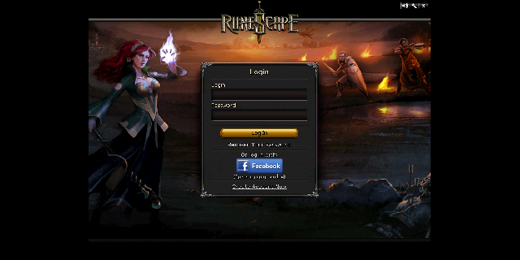

# Single RS 2012 — Android Port

This directory is the Android client build of **Single RS 2012**. It wraps the
`darkan-client` (2012-era RuneScape client) with an AWT compatibility shim and
an Android renderer so the game can run on phones and tablets.

> **Status: boots to the login screen on an Android emulator.** The client and
> the full world server build into one APK; the server starts in-process, listens
> on 127.0.0.1:43595, and the client connects to it, renders through the software
> renderer, and reaches its login prompt. Verified end to end by the
> [emulator test](#emulator-testing) on API 26, with screenshots.
>
> 
>
> **Not yet done: logging in.** Keyboard input is not wired, so the username and
> password fields cannot be typed into. Nothing has run on physical hardware.

## Layout

```
android/
├── app/
│   ├── build.gradle            # Android module (client + server sources)
│   └── src/main/
│       ├── AndroidManifest.xml
│       ├── java/
│       │   ├── java/awt/...    # AWT compatibility shim (Android ships none)
│       │   ├── javax/, sun/    # swing / imageio / Unsafe stubs
│       │   └── com/rs/android/ # GameActivity, GameSurfaceView, bridge
│       └── res/
├── tools/
│   └── downgrade-bytecode.gradle   # rs.darkan:core Java 24 → Java 17
├── app/build/generated/cache-assets/cache/   # staged game cache (generated)
├── build.gradle                # root build
├── settings.gradle
└── gradlew / gradle/wrapper    # Gradle 8.14.3
```

`app/build.gradle` compiles three source trees into one module: the app's own
`src/main/java`, `darkan-world-server/src/main/{java,kotlin}`, and
`darkan-client/src/main/java`.

## Build

```sh
cd android
./gradlew :app:assembleDebug
```

Requires an Android SDK. `local.properties` points at
`/home/kennethhy/Documents/android-sdk` on this machine; set `sdk.dir` to your
own SDK path. The debug APK is written to
`app/build/outputs/apk/debug/app-debug.apk`.

`minSdk` is **26** (Android 8.0). The world server's dependency stack requires
it: `undertow-core` — and `MethodHandle.invoke` generally — only dexes at API
26 or above.

### The bundled game cache

The APK ships the full 2012 cache — **~837 MB**, taking the debug APK to about
**860 MB**. `stageCacheAssets` stages `main_file_cache.dat2` and the `idx*`
files out of `darkan-cache/` into `app/build/generated/cache-assets/cache/`,
which is registered as an assets source directory, and writes a `manifest.txt`
of name/size pairs alongside them.

`main_file_cache.dat2` is listed in `androidResources.noCompress`: it is already
compressed archive data, so deflating it would cost minutes of build time for a
0.03% saving. Stored, a clean build takes about 75 seconds.

The cache is **not in git** — `.gitignore` excludes `darkan-cache/main_file_cache.*`,
so it arrives with a release drop. Two escape hatches:

```sh
./gradlew :app:assembleDebug -Pdarkan.cacheDir=/path/to/darkan-cache
./gradlew :app:assembleDebug -Pdarkan.bundleCache=false   # cache-less; cannot start a world
```

Without either, the build fails with a message pointing at both.

#### On-device extraction

`AndroidPlatform.extractCacheIfNeeded` copies the cache out of assets into
internal storage on first launch. It has to: the client *and* the world server's
`rs.darkan:core` both open the cache with `RandomAccessFile`, and core is a
prebuilt jar that cannot be taught to read from an `AssetManager`. So the app
costs **~1.7 GB installed** — once in the APK, once extracted — and the first
launch spends a minute or two copying, with progress drawn on the surface by
`GameSurfaceView.drawStatus` rather than sitting on a black screen.

Extraction is driven by `manifest.txt`. Each file is written to a `.part` and
renamed only once its size matches, and the `.cache-complete` marker stores the
manifest it was produced from — so a kill mid-extract, or a newer bundled cache,
both re-extract instead of leaving a truncated cache that looks complete.
Failures propagate to `AndroidLoader.boot`, which reports them on screen rather
than launching into a broken world.

### The `rs.darkan:core` bytecode downgrade

`rs.darkan:core:2.0.6` is published as **Java 24 bytecode (class file major
68)**. The Android build compiles with JDK 21 javac (which reads at most 65)
and D8 accepts at most Java 17 (61), so as published the jar is unreadable —
every import of it fails with `cannot access X / bad class file … wrong version
68.0`, which cascades into hundreds of unrelated-looking `cannot find symbol`
errors across the server.

The `downgradeDarkanCore` task (see `tools/downgrade-bytecode.gradle`) rewrites
the class-file version header of every class in the jar down to 61, and the
module consumes that copy as a file dependency instead of the published one.
The jar contains no post-17 bytecode constructs — no
`java.lang.runtime.SwitchBootstraps`, no preview attributes, only records
(class 60+, which D8 desugars) — so the header rewrite is lossless. The task
fails loudly if it ever encounters preview bytecode.

Because a file dependency carries no Gradle metadata, `core`'s transitive
dependencies are declared explicitly in `dependencies { }`.

## How the shim works

Android's SDK does **not** provide the classic `java.awt` classes (`Color`,
`Font`, `Graphics`, `Image`, `Component`, `Canvas`, `Frame`, `Toolkit`, …).
The desktop client is deeply coupled to AWT — 59 files import `java.awt`, and
the render pipeline centers on `Class351.gameCanvas` (a `java.awt.Canvas`).

`java/awt/**` recreates the subset of AWT the client needs:

| Area | Shims |
| --- | --- |
| Rendering | `Graphics`, `Image`, `BufferedImage`, `WritableRaster`, `Raster`, `DataBuffer(int)`, `SampleModel`, `DirectColorModel`, `PixelGrabber` |
| Geometry | `Color`, `Font`, `FontMetrics`, `Point`, `Rectangle`, `Dimension`, `Insets`, `Shape`, `Cursor` |
| Host/windowing | `Component`, `Container`, `Canvas`, `Frame`, `Window`, `Toolkit`, `GraphicsEnvironment`, `GraphicsDevice`, `GraphicsConfiguration`, `DisplayMode`, `Robot` |
| Input | `event.*` — `KeyEvent`, `MouseEvent`, `MouseWheelEvent`, `FocusEvent`, `WindowEvent`, `ActionEvent`, all listener interfaces, `EventQueue` |
| Misc | `datatransfer.*` (Clipboard), `Desktop`, `ImageObserver`, `ImageProducer`, `ImageConsumer` |

The shim is complete enough that the desktop `com.rs.Loader` itself compiles
unchanged — it extends `java.awt.Panel`, implements `MenuContainer`, and opens
a `JFrame`, all of which the shim satisfies headlessly. Android does not run
its `main`; `com.rs.android.AndroidLoader` drives the client instead, but the
engine still reads `Loader`'s constants and `clientParams`.

`com/rs/android/GameSurfaceView` renders an `int[]` ARGB frame (produced by the
client's safe-mode `JavaRenderer`, which already blits to a
`Class158_Sub2_Sub3_Sub1` pixel buffer) scaled to the screen, and translates
touch into the game's mouse model.

## Emulator testing

`.github/workflows/android-emulator.yml` boots the APK on an emulator and reports
which boot checkpoints it reaches, capturing logcat and screenshots as artifacts.
It runs cache-less by default; add the `full-cache` label to a PR (or dispatch
with `with-cache`) to pull the real cache from the latest release and test the
whole thing.

`android/tools/check-api-levels.py` resolves every platform method and field
reference against the SDK's `api-versions.xml` -- the database Lint's `NewApi`
check uses, which Lint does not apply to a prebuilt dependency's classes. It
reads the APK's dex for what actually ships, or a jar to attribute findings to
the calling class. Written after several rounds of one-`NoSuchMethodError`-per-
emulator-run.

## Remaining work

### 1. Keyboard input

Touch is wired (`Component.dispatchInputEvent`), but key events are not, so the
login form cannot be filled in. Needs Android key events translated to AWT
`KeyEvent`s and a way to raise the soft keyboard.

### 2. Physical device testing

Everything so far is an emulator, configured with a 1 GB heap. `largeHeap`
typically yields 256-512 MB on a real phone, and the server hit an
`OutOfMemoryError` in its startup hooks below that. Whether the app fits on real
hardware is unknown; if it does not, the fix is server-side (fewer simulated
players, smaller caches) rather than a build setting.

### 3. Loose ends

- `os.name` is `linux` and cannot be corrected (see below), so
  `NativeLibraryLoader` tries to `dlopen` the desktop renderer libraries and
  fails with `UnsatisfiedLinkError: libstdc++.so.6`. Caught and survivable;
  probably costs sound.
- Several `[SEVERE]` log lines with empty messages during startup
  (`Settings.loadConfig`, `PacketHandlers`, `CharmDrop`) are unexplained.
- Reaching the login screen does not prove `AndroidClassScanner` found the same
  handler set ClassGraph would; a shortfall there would show up as missing game
  behaviour, not an error.
- `com.rs.cache.loaders.FontMetrics` uses `List.toArray(IntFunction)` (API 33).
  Server-side, referenced only from `Utils`, and unreached so far.

### A note on system properties

Android's libcore wraps the core system properties in
`PropertiesWithNonOverrideableDefaults`: `System.setProperty` for `java.version`,
`os.name` and others is **silently dropped**, with only a log warning, so the call
appears to succeed. `java.version` reads as `"0"`, which the client parsed as
Java 0 and hid the login screen behind an "Unsupported Java Warning"; `Engine`
reads a `darkan.java.version` override instead. `user.home` *is* changeable,
which is why pointing the client's scratch cache at internal storage worked.

## Android-only stubs and exclusions

Because the client, the server, and their AWT surface are shared with the
desktop builds, a few files are replaced by app-local Android stubs or dropped
outright. The exclusions live in `app/build.gradle`.

> **Note:** a source set's `exclude` patterns are matched against *every*
> `srcDir` in that set. A plain pattern like `com/rs/jagex/Class191.java`
> therefore also drops the Android replacement that shares the path, leaving
> the class unresolvable. The Java exclusions are scoped by absolute path for
> exactly this reason.

| Upstream file | Android handling | Why |
| --- | --- | --- |
| `com/rs/jagex/Class191.java` | app stub | Swing `JFileChooser` absent on Android |
| `com/rs/jagex/Class253_Sub1.java` | app stub | `javax.sound.sampled` absent on Android |
| `com/rs/jagex/FileFilter_Sub1.java` | app stub | Swing file filter |
| `com/rs/tools/MapImageDumper.java`, `old/MapDump.java`, `old/MapGenerator.java`, `com/rs/utils/BigBufferedImage.java` | excluded | need `javax.imageio` + `java.awt.color`; offline map dumpers only |
| `com/rs/plugin/kts/PluginScript{,Configuration,Host}.kt` | excluded | hosting the Kotlin compiler on ART is not possible. `PluginManager` and `MiscDeveloperCommands` already reach the host reflectively and skip it when `darkan.android=true`. Dropping these also drops `kotlin-scripting-*` / `kotlin-compiler-embeddable` (~100 MB, and it does not dex). `PluginGlobals.kt` **stays** — it is plain event registration that hundreds of content files import. |
| `com/rs/utils/bench/**` | excluded | JMH benchmarks, dev-only |
| — | `sun/misc/Unsafe.java` | hardware renderers reference it; software path never calls it |
| — | `javax/imageio/ImageIO.java` | debug "dumpitems" command only |

The rest of `com.rs.tools` is kept: `MiscDeveloperCommands.kt` calls into
`MapSearcher`/`NPCDropDumper` and `NPC.java` into `com.rs.tools.old.CharmDrop`,
so excluding the package wholesale would leave dangling references at dex time.

### Kotlin module name

Kotlin mangles `internal` members as `name$moduleName`, and world-server Java
sources call them by that exact name (`Bank.java` calls
`Potion.drink$world_server`). The Android Kotlin plugin would name this module
`app_debug`/`app_release`, so `app/build.gradle` pins it to `world-server` on
the `KotlinCompile` task. Setting `kotlinOptions.moduleName` is *not* enough —
the Android plugin still appends the variant name to it.

Note that `SourceDirectorySet` filters declared in the `kotlin { }` source-set
block are not honoured by `KotlinCompile`; Kotlin-only exclusions must be set
on the task.

## Shared-source changes for Android

These edits are in `darkan-world-server/` and apply to both builds — the
desktop build is unaffected by design:

| Change | Files |
| --- | --- |
| `jdk.jfr` reached reflectively through the new `TickRecorder`; unavailable on ART, so recording is skipped there | `engine/thread/WorldThread.java`, `engine/thread/TickRecorder.java` |
| `java.lang.management` → `java.lang.Runtime` (heap only, so non-heap usage is no longer counted) | `utils/WorldUtil.java`, `engine/thread/WorldThread.java` |
| Java 21 `SequencedCollection` (`getFirst`/`getLast`/`removeFirst`) → `List` equivalents; `android.jar` has no such methods | 24 files under `game/content/**`, `utils/record/Recorder.java` |
| Qualified enum switch labels (Java 21) → unqualified | `skills/agility/agilitypyramid/AgilityPyramidController.java` |
| `Random.nextInt(origin, bound)` → `nextInt(bound)` (both call sites use origin 0) | `quests/wolfwhistle/WolfWhistleWellCutscene.java` |
| `Files.readString` → `readAllBytes` + `new String(..., UTF_8)` | `db/collection/HighscoresManager.java` |
| Virtual threads → daemon platform threads | `engine/thread/AsyncTaskExecutor.java` |

## References

- `darkan-client/` — the client sources this project wraps.
- `darkan-world-server/` — the world server, compiled into this APK.
- `docs/` — project website.
- `Single-RSC-Mobile` — sibling RSC client already ported to Android; its
  `AndroidPlatform` and `GameSurfaceView` are the reference implementation.
